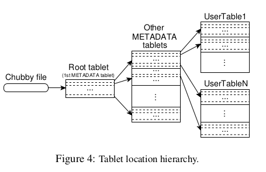
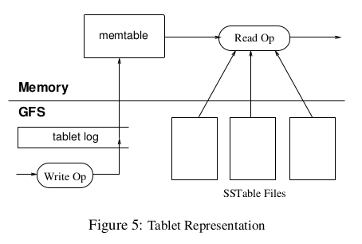
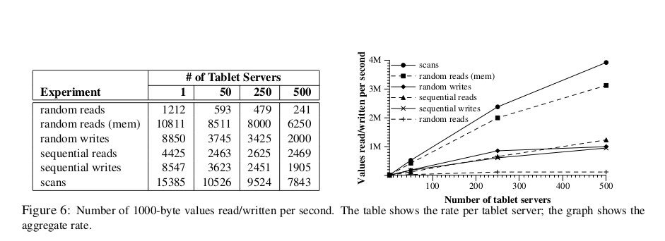

***Gunther Karolyi Gutierrez***   
***2017238873***   
***IC4302 - Bases de Datos 2***   
***Grupo 01***   
***Lectura 2***  

# BigTable: A Distributed Storage System for Structured Data

A BigTable is a distruibuted storage system for managing structed data that is designed to scale to a very large size: patabytes of data across thousands of commodity servers. Achiving several goals as wide applicability, scalanility, high performance and high availability.

## Data Model

A BigTable is a sparse, distributed, persistent multidimensional sorted map. The map is indexed by a row key, column key and a timestamp. Each value in the map is an uninterpreted array og bytes. 

**(row:string, column:stirng, time:int64) -> string**

### Rows 

The row keys in a table are arbitrary strings. Every read or write of data under a single row key is atomic. 
BigTable maintains data in lexicographic order by row key. Each row range is colled a *tablet*, wich is the unit of distribution and load balancing.

### Column Families

Column keys are grouped into sets called column *families*, wich form the basic unit of access control. All data stored in a column family is usually of the same type.
A column key is named using the following syntax: **family:qualifier**.
Access control and both disk and memory accounting are performed at the column-family level.

### Timestamps

Eaach cell in a BigTable can contain multiple versions of the same data, these versions are indexd by timestamp.

## API

The BigTable API provides functions for creating and deleting tables and column families. It also provides functions for changing cluster, table and column family metadata, such as control rigths.

## Building Blocks

BigTable is built on several other pieces of Google infrastructure. The BigTable uses the distributetd Google File System (GFS) to store log and data files. A Bigtable cluster typically operates in a shared pool of machines with processes from other applications. Bigtable depends on a cluster management system for scheduling jobs, managing resources in shared machinesm dealing with machine failures and monitoring machine status.
The Google SSTable file format is used internally to store Bigtable data. An SSTable provides a persistent, ordered immutable map from keys to values where both keys and values are arbitrary byte strings.
Internally, each SSTable contains a sequence of blocks. A block index is used to locate blocks, the index is loaded into memory when the SSTable is opened. A lookup can be performed with a single disk seek or a SSTable can be completely mapped into memory to perform lookups and scan without touching disk.
Bigtable relies on a highly-available and persistent distributed lock service called *Chubby*. A Chubby service consists of a five active replicas, one of which is elected to be the master and actively serve reports. To keep its replicas consistent the Paxos algorithm is used.

Chubby uses:
1. Ensure that there is at most one active master at any time
2. To store the bootstrap location of Bigtable data.
3. To discover tablet servers and finalize tablet server deaths
4. To store Bigtable schema information
5. To store access control list

## Implementation

The Bigtable implementation has three major components.
* A library
* A master server
* Many tablet servers

Tablet server can be dynamically added (or removed) from a cluster to accomodate changes in workloads.
The master is responsable for assigning tablets to tablet servers, detecting the addition and expiration of tablet servers, balancing tablet-server load and garbage colection of files in GFS.
The tablet server handles read and write request to the tablets that it has loaded and also splits tablts that have grown too large.

### Tablet Location

A three-level hierarchy were used analogous to that of a B+-tree, to store tablet locatuion information. The hierarchy is presented in the following figure.

### Tablet Serving

The persistent state of a tablet is stored in GFS. Updated are commited to a commit log taht stores redo records. Of these updates, the recently commited ones are stored in memory in a sorted buffer called a *memtable*, the older updates are stored in a sequence of SSTables.

## Refinements

The implementation required a number of refinements to achive the high performance, availability and reliability required by users.

* Locally groups
    Client can group multiple column families together into a *locality group*

* Compression
    Clients can control whether or not the SSTTables for a locality group are compressed, and if so, which compression format is used.

* Caching for read performance
  To improve read performance, tablet servers use two levels of caching.

* Bloom filters
  Reduced number of accesses to disk by allowing clients to specify that Bloom folters should be created for SSTables in a particular locality group.

* Commit-log implementation
  A single commit log is used per tablt server, this reduces disk seeks.

* Speeding up tablet recovery
  If master moves a tablet from one tablet server to another, the source tablet sever first does a minor compaction on that tablet. This compaction reduces the recovery time.

* Exploting immutability

## Performance Evaluation

A Bigtable cluster with N tablet severs was set up to measure the performance and scalability of the BigTable as B is varied. The results are presented in the following figure.

