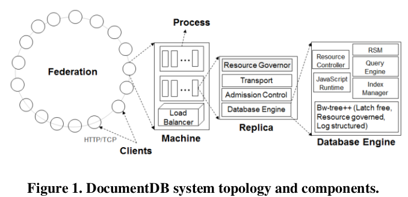
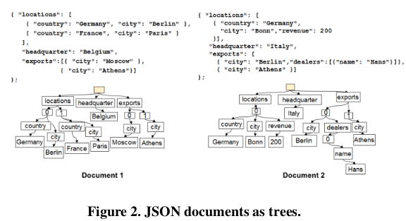

***Gunther Karolyi Gutierrez***   
***2017238873***   
***IC4302 - Bases de Datos 2***   
***Grupo 01***   
***Lectura 4***  

# Schema-Agnostic Indexing with Azure DocumentDB

## Introduction

Azure DocumentDB is Microsoft's multi-tenant distributed database service for managing JSON documents at Internet scale.

### Overwiew fo the Capabilities

DocuentDB is based on the JSON data model and JavaScript language directly within its database engine.
DocumentDB capabilities:

* The query language supports rich relational and hierarchical queries.
* The database engine is optimized to serve consistent queries in the face of sustained high volume document writes. By default, the database enegine automatically indexes all documents.
* Transactional execution of application logic provided via stored procedures anf triggers, authored entirely in JavaScript and executed directly inside DocumentsDB's database engine.
* DocumentDB offers well-defined and tunable consistency levels for developers.
* As a fully-managed, multi-tenant cloud database service, all machine and resource management is abstarcted from users.

### System Topology

The DocumentDB service is deploy worldwide across multiple Azure regions. They deploy and manage DocumentDB service on clusters of machines each with dedicated SSDs. Each machine hosts replicas corresponding to various resource partitions within a fixed set of processes. Replicas corresponding to the resource partitions are placed and load balance across machines in the federation. Each replica hosts an instance of the DocumentDB database engine wich manages the resources as well as the associated index.

### Design Goals for indexing 

* Automatic Indexing
* Configurable storage/performance tardeoffs
* Efficient, rich hierarchical and relational queries
* Consistent queries in face of sustained volume of document writes
* Multi-tenancy

## Schema Agnostic Indexing

### No Schema, No Problem!

The schema of a document describes the structure and the type system of the document independent of the document instance. With the goal to eliminate the impedance mismatch between the database and the application programming models, DocumentDB exploits the simplicity of JSON and its lack of a schema specification. It maks no assumption about the documents and allows documents withon a DOcumentDB collection to vary in schema.

### Documents as Trees

The techinique which helps blurring the boundary between the schema of JSON documents and their instance values, is representing documents as trees. It normalizes both the structure and their instance values.

### Index as a Document

With automatic indexing, every path in a document tree is indexed. Each update of a document leads to update of the structure of the index. One of the primary requirements of automatic indexing of documents is to ensure that the cost to index and query a document at any level is the same as that of a flat JSON.
There are 2 possible mappings of a document and the paths:
1. Forward index mapping
2. Inverted index mapping

### DocumentDB Queries

SQL and JavaScript queries get translated to an internal intermediate query language called DocumentDB Query IL. One unique aspect of the DocumentDBs queries is taht since they operate directly against the tree representation instead od rows and columns in a relational table, they allow one to refer to properties in JSON docuemnts at any arbitrary depth.

## Logical Index Organization

The index is a union of all the documents and is also represented as a tree. Each node of the index tree contains a list of document ids correspnding to the documents containing the given label value. The tree representation of documents and the index enables a schema-agnostic database engine.

### Directed Paths as Terms

A term represents a unique path in the index tree. The direction of the path (forward | reverse) has associated tradeoffs including, storage cost, indexing maintenance cost and cost of lookup query.

### Bitmaps as Posting Lists

A posting list captures the document ids of all the documents which contain the given term.The size of the posting list is a function of the document frequency - the number of documents in the collection that contains a given term as well as the pattern of occurrence of a document ids in the posyings list.

## Physical Index Organization

### The Bw-Tree for DocumentDB

The Bw-tree uses latch-free in-memory updates and log structured storage for persistence. It expploits two treds in modern hardware; muticore processors with multi-level memory/cache hierarchy and flash memory based SSDs with fast random reads. The latch-free property ensures taht threads do not block and readers do not conflict with writers.

### Index Replication and Recovery

DocumentDB follows a single master model for writes, clients issue writes against the distinguished primary replica of the replica set, wich in-turn propagates the client's request guaranteeing a total order to the secondary replicas in the set.